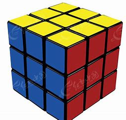
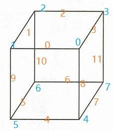
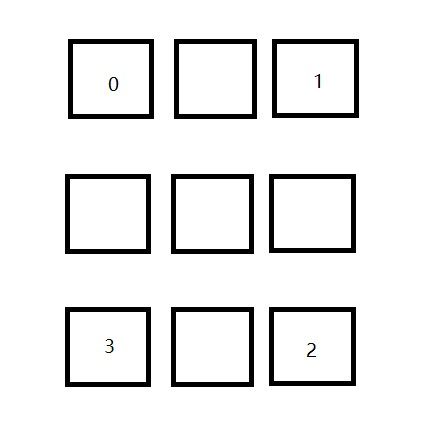
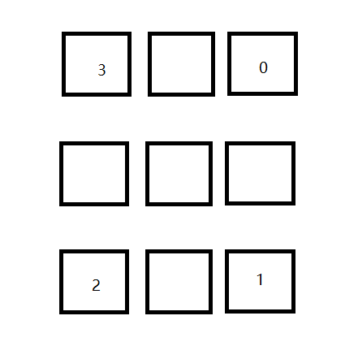

- [如何使用计算机还原魔方？](#如何使用计算机还原魔方)
  - [**一、关于魔方**](#一关于魔方)
    - [**1. 旋转**](#1-旋转)
    - [**2. 块的方向**](#2-块的方向)
  - [**二、如何在计算机里表示魔方**](#二如何在计算机里表示魔方)
    - [**① 数据结构**](#-数据结构)
    - [**② 转动**](#-转动)
  - [**三、计算机还原魔方算法**](#三计算机还原魔方算法)
    - [**1. 群的简单了解**](#1-群的简单了解)
    - [**2. 降群法**](#2-降群法)
    - [**3. 科先巴二阶段算法（kociemba)**](#3-科先巴二阶段算法kociemba)
    - [**4. 魔方状态编码**](#4-魔方状态编码)
    - [**5. 对魔方的搜索算法**](#5-对魔方的搜索算法)
      - [**① A*算法**](#-a算法)
      - [**② IDA*算法**](#-ida算法)
    - [**6. 搜索前的准备**](#6-搜索前的准备)
    - [**7. 转动表**](#7-转动表)
  - [**四、结尾**](#四结尾)

# 如何使用计算机还原魔方？

简单介绍一下计算机还原魔方的算法。我会尽量用最简单的语言来描述计算机是如何还原魔方的，尽力让不是计算机专业的人和不怎么玩魔方的人也能看懂。

---

## **一、关于魔方**
魔方，大家肯定都很熟悉，不熟悉的起码也知道大概长啥样，最常见的是三阶魔方



PS:(网上瞎找的图)

魔方有6个面，8个角块，12个棱块。同时每个角块会有3种方向（未发生旋转、顺时针旋转120°、逆时针旋转120°），棱块有两种方向（未翻转、翻转），所以通过这些量就可以大致计算出魔方的状态数（有效状态）为：
$\frac{8!\times12!\times2^{12}\times3^{8}}{2\times3\times2}\approx4.43(千亿亿)$

至于为什么是这样算，请自行百度，这里只是为了体现魔方状态数非常大。

好了，言归正传，我们现在了解了魔方的总状态数后，还需要了解一些关于魔方的基础知识

### **1. 旋转**
魔方的每个面都有三种旋转方式，顺时针90°、逆时针90°和180°。那么如何简便表示这些旋转呢？对于一个魔方玩家而言可能非常熟悉，但是对于魔方新手或是小白就比较陌生了，这里只简单介绍一下——辛斯马特标记

六个面用六个字母表示：
U(Up)、D(Down)、L(Left)、R(Right)、F(front)、B(Back)

同时，用 **单个字母** 表示该面的 **顺时针旋转**，**单个字母加撇号** 表示 **逆时针旋转**，**单个字母+"2** 表示 **旋转180°**。

例如：
```
U：顶面顺时针旋转90°
U'：顶面逆时针旋转90°
U2：顶面旋转180°
```
以此类推。

### **2. 块的方向**

在上文中，我们提到了魔方块的方向。关于魔方块的方向，其实不难理解，只要你能找到一个魔方来观察即可。

但是还有一些需要补充，关于魔方角块的旋转和魔方棱块的翻转。

角块的方向可以用0、1、2来表示（1：表示顺时针旋转，2：表示逆时针旋转）

棱块的方向可以用0、1来表示（1：表示翻转）

一般来说，对于棱块和角块，只要其U面处于U/D面，就可以说是方向为0，同理，只要其F面处于F/B面就可以说是方向为0。

```
举个栗子，假如现在你的U面是黄色，那么D面一定是白色（不知道的话找个魔方看看），此时，如果U面除了黄色以外只剩白色，那么就认为你的魔方U面的所有块的方向为0。
```
那么问题来了：哪些操作会改变魔方块的方向呢？

此时此刻，有魔方的小伙伴完全可以拿出魔方来试试，没有的话就直接看结论吧。

- 首先在U/D面的操作不会使魔方角块的方向改变
- 任意面上的X2（X指代魔方的面的字母）操作不会改变魔方块的方向（角块、棱块都不会）
- 可以规定只有F、B的操作会改变棱块方向（只要规定合理即可，也可以规定其他两个相对的面能改变棱块方向）
- F、B、L、R的操作会改变角块方向
  
PS：上述的X操作可以是X'

---

## **二、如何在计算机里表示魔方**
如何在计算机里表示魔方，说专业点叫做设计数据结构来存储魔方。

### **① 数据结构**

设计数据结构前，我们需要了解魔方的特征，不过魔方能够被用于计算的特征我已经在前面大致讲完了，6个面，8个角块，12个棱块，角块3个方向，棱块2个方向。

那么我们只需要将这些特征抽象一下就好了（例如方向的表示方法）

PS： 可以按自己的喜好

6个面：0~5 （分别为U、D、F、B、L、R）

8个角块：0~7（方向：0、1、2）

12个棱块：0~11（方向：0、1）

好了，这样一来，我们的整个魔方都可以用数字表示了，但是具体的哪个块对应哪个数字你可以自己定义。

例子如图：




标得有点乱，仔细看看还是能看出来

好了，至此，一个魔方的数据结构就定义好了，具体实现时，C/C++中，六个面可以用枚举类型来表示，至于块和方向，可以用结构体绑在一起，然后用数组表示，也可以分开用数组表示。（当然，这不是这篇文章的重点，重点是介绍，如果有想看实现的，请移步我的之前的文章或者参照着自己实现）

### **② 转动**

那么有了数据结构，我们就可以在计算机上表示出一个魔方了（尽管用几组数字表示出来的魔方可能会有些抽象），但是现在我们的魔方还不能转。所以如何实现魔方的转动呢？

观察魔方，对于魔方的一个面而言，是不是一定有四个角块和四个棱块。我们之前对方块的编码在这里就用得上了。

**顺时针旋转前**



**顺时针旋转90°后**



拿上图的角块举个例子，初始时，四个角块的编码是这样的
```C
corner_p1 = [0, 1, 2, 3];
```
旋转90°后四个角块就变为了
```C
corner_p2 = [3, 0, 1, 2];
```
好像不难发现其规律？如果是旋转180°呢？是不是就是在corner_p2的基础上再旋转90°？
```C
corner_p3 = [2, 3, 0, 1];
```
好了，到此魔方的旋转也已经可以在计算机上实现了，不过还需要注意一点，旋转时是会发生方块的方向变化的！到底哪些操作会导致哪些方块方向增加，导致哪些方块方向减小？这些都是需要注意的。


---

## **三、计算机还原魔方算法**

好的，终于到了激动人心的时刻了，我们终于要介绍计算机还原魔方的算法了。

不过在真正了解计算机还原魔方的算法前，我们还需要了解一种东西——群。

### **1. 群的简单了解**

当然了，这里的群不是指QQ群、微信群，是指离散数学中的群论。不过不要担心，这里并不会涉及到什么高深的知识，也不会详细讲解群论（因为我也没学懂），只是如果要了解计算机解魔方的原理，那么就不得不提及它。

在这里，你可以简单地把群理解为一个数学概念上的集合（不了解集合的小伙伴们，直接百度吧），只不过这个集合需要满足某种运算规则，才可以称之为群。（这里的描述实在是不严谨，但为了方便理解，就这样吧）

注意，要构成群，首先要有一个集合，同时这个集合需要有一个运算规则来使它满足一些条件，比如在实数域（集合）上对加法构成一个群。

好了，我们来举一反三一下，是不是可以说魔方这个集合对我们之前所介绍的旋转操作（需要加上块的方向的改变）构成一个群呢？

不仅如此，我们还可以证明不同状态的魔方可以属于不同的子群。

### **2. 降群法**
哈哈，依旧不是讲我们的大标题，是不是很失望？但实际上我们的大标题的算法基础就是这个降群法。

之前我们说过，魔方的状态可以决定它此刻属于哪一个子群，而降群法就是基于这个原理来还原魔方。

这里我直接写出降群法的五个子群（四个阶段）：
```
G0 = <U, D, F, B, L, R>
Phrase1->
G1 = <U, D, F2, B2, L, R>
Phrase2->
G2 = <U, D, F2, B2, L2, R2>
Phrase3->
G3 = <U2, D2, F2, B2, L2, R2>
Phrase4->
G4 = <I>
```
好的，首先看G0，不难发现，在这个子群中，魔方将能达到一个最混乱的状态，因为在我们的定义中，单独一个面旋转90°都有可能改变魔方棱块、角块的方向。因此，在这个子群中，魔方的状态是最混乱的。

然后是G1子群，它与G0子群的区别在于我们在这个子群中，无法进行F、B操作，因此我们无法改变棱块的方向，所以在这个子群中的魔方状态是已经把所有棱块方向对好的状态，但是由于可以进行L、R操作，所以我们的角块方向并没有对好。

经过一些列调整后，我们的群可以降到G2子群，此时此刻所有的魔方块的方向都已经对好，即都为0，同时属于中间层的块都处在中间层。在这个子群当中，魔方没有还原仅仅是因为各个块的位置是错的。（注意，在这个子群中，属于U/D面的色块都处于U/D面，同时中间层的F/B面的色块也必须是F/B面，否则方向不为0）

再经过一番角块、棱块的调整，群被降解到G3，此时我们的魔方的角块位置正确，同时属于F/B面的色块在F/B面，属于L/R面的色块在L/R面。

再经过G3中的操作后，魔方就可还原。

上述的降群法是数学意义上能够证明的方法，也是为什么魔方能够被还原的证明。

（注：原则上人类也能通过降群法还原魔方）

### **3. 科先巴二阶段算法（kociemba)**

通过上面降群法的解析，不难发现，降群法好像有四个阶段，而我们要着重介绍的科先巴二阶段算法，只有两个阶段。

**这是因为这个算法中将前两个和后两个阶段合并了。**
```
G0 = <U, D, F, B, L, R>
Phrase1->
G1 = <U, D, F2, B2, L2, R2>
Phrase2->
G2 = <I>
```
实际上，如果你把之前的降群法理解了，这个科先巴二阶段算法就不那么难理解了。（无非就是合并了两个阶段）

第一阶段：
1. 所有魔方块的方向都为0
2. 属于中间层的块位于中间层（这与所有属于U/D面的色块都在U/D面是一个意思）

第二阶段：
直接还原魔方

到此，对于不是计算机专业的朋友已经足够了，而后面将要介绍一些关于实现方面更多的东西，当然了，不是计算机专业或者不想了解实现的同学已经可以退出了，如果对后面的内容感到好奇或者想用计算机写程序实现的同学可以接着看（放心，如果前面的都坚持看完了，后面的不至于看不懂）。

### **4. 魔方状态编码**

在了解了两种算法之后，不知道你有没有一种疑问，什么叫魔方的状态？

其实不难想到，一个魔方此时此刻的状态是由此刻所有的魔方特征决定的。而且我们在上文提到过一个三阶魔方的总状态数的计算方法，无非就是一些排列组合的知识。

但是问题来了，我们仔细观察上面讲述的两种算法，好像更多地是对其中一种特征的关注。比如降群法中的第一阶段，只关注了棱块的方向。而且话说回来，魔方的总状态数是4.43千千亿还要多，如果真要让计算机存下所有的状态数，那必然会将资源耗尽，所以我们设想的暴力穷举在现在是不可能的。

所以，我们要尽量地只关注离散的特征状态。

所以我们在实现时，必然要在每个阶段对不同的特征进行状态编码。例如在降群法中的第一阶段，只需要对棱块方向编码即可，而棱块方向的状态数只有 $2^{12}$, 比之魔方总状态小了几个数量级。

所谓状态编码，其实就是对状态的量化，将一个抽象的状态转化为一个数字，对状态编码后，我们就可以用一个按照编码规则产生的具体的数字来描述这个状态。简而言之就是一种映射或者说是对应关系。通过这个关系，我们可以把状态对应到一个数字上，也可以把数字对应到状态上。

比如对棱块方向的编码，我们完全可以使用二进制的规则进行编码。

### **5. 对魔方的搜索算法**

搜索，这个词对于计算机专业的同学来说可能不陌生，对于非计算机专业的同学来说可能也不陌生，毕竟现在搜索引擎这么发达，说不定我这篇垃圾文章也是你们搜索来的。

不过计算机术语上的搜索跟平时的搜索在大意上是相近的，都是找东西，找“自己”想要的东西。

只不过计算机当中的搜索算法是一种基于图论的算法，至于不知道图论的朋友，没关系，这里涉及不到图论，而且对于搜索的理解也不需要图论的支撑（仅仅是理论上和实现上需要）。

同时也可以到b站上看看相关可视化视频，相信你可以很快就了解与搜索有关的知识。

通过前面对魔方状态的了解，我们知道魔方的状态非常非常多，所以一般的非启发式搜索的深搜、广搜是完全不能满足的。

深搜是深度优先搜索，说简单点就是不撞南墙不回头，一根筋走到底。然而对于魔方而言，深搜有极大地可能走向了一种不可解决魔方的移动。什么意思呢？用成语解释就是南辕北辙，更可怕的是，深搜时，计算机根本意识不到自己走向了错误的方向，导致程序一直运行，无法得到解。

广搜是广度优先搜素，说简单点就是来者不拒，不管下面有多少分支、多少节点，不管这些分支能不能行通，都把它们加进来，按照队列的方式挨个搜。用广搜虽然可以找到解，甚至是最优解，但是不难发现，这个算法对计算机资源的开销是非常大的，对于现在的一般的计算机而言，解魔方，是不能够支持的。很有可能在运行过程中就爆内存了。而且广搜想要找到解，完全可能是一个漫长的过程。

到这里可能有的同学就要说了，既然非启发式的不行，咱就用启发式的。

没错，咱还真就用启发式搜索 —— IDA*。

为了照顾到不了解的小伙伴，我还是在简单说一下什么是IDA*算法。首先看一下百度百科上的解释：

```
IDA*算法是基于迭代加深的A*算法。
迭代加深只有在状态呈指数级增长时才有较好的效果，而A*就是为了防止状态呈指数级增长的。
IDA*算法其实是同时运用迭代加深与全局最优性剪枝。
```

好了，看完百科似乎又多出了一个A*算法，所以还不如不看(bushi)!

......

好吧，咱慢慢来，首先来说说启发式搜索和非启发式搜索的区别。其实很简单，两者区别仅仅只是在搜索不同的节点时是否有优先级的区别。

例如我通过一些数学计算得到的这个节点的优先级最高，所以我先搜它，因此把这种搜索方式称为启发式搜索，而每个待搜索节点的优先级相同，那么就是非启发式搜索。

其实这是很好理解的，比如我们要出门，去某个地方，那么我们是否会根据当天的天气情况、路况、甚至是自己的经济情况来选择不同的交通工具以及行驶路线，这种决策方式就是一种启发式的。

而不同的启发式搜索的区别大部分在于启发函数以及评估函数的不同。

那么什么又是启发函数呢？这里你可以理解为一个可以影响优先级的函数。也就是说，不同的启发函数可能会造成不同的搜索结果。简而言之，启发函数影响了我们的搜索决策是怎样的。（这里可以再次类比前面出门的例子理解，不同的天气情况、路况、经济情况都会造成决策的不同）

那么什么又是评估函数呢？评估函数其实就是我们的综合优先级，评估函数的结果会受到启发函数的影响。当然，你可以简单理解为我们对算法的决策进行评优，差的打低分，好的打高分，这样一来，我们的搜索算法将会以极快的速度朝着我们想要的方向进行。（在各类棋类游戏中，最能体现评估函数的作用）

#### **① A*算法**

终于，为了照顾没学过 A* 算法的同学， 咱还是来讲讲这个 A* 算法。

那么废话不多说，我们直接看 A* 的评估函数：
```
f(n) = g(n) + h(n)
```

好的，看到这个公式，是不是开始头痛了？没关系，我刚开始学的时候头也痛，咱慢慢分析。

f(n): 不必多说，这个是节点n的综合优先级。

g(n): 这个是指当前节点n距离起点的代价；在魔方算法中可以理解为，这个魔方此时的状态，和起始状态相比，拧了多少次。

h(n): 这个是指当前节点n距离终点的预测代价；在魔方算法中可以理解为，此时的这个魔方状态，距离我想要的结果（比如还原魔方），最多还需要拧多少步。而这个也是我们 A* 的启发函数。

而 A* 算法的搜索是一种基于广搜的改进，也就是说，咱们还是没有办法控制搜索深度，对魔方还原的搜索依旧有可能朝着非常远或者非常深的地方进行。而搜索得越深，意味着需要走的步数越多，解也就不算优，而且广搜对空间的开销非常大。故而我们不采用 A* 算法。

#### **② IDA*算法**

重头戏终于来了，IDA* 算法是基于 A* 算法的一种改进，可以控制搜索的深度。

什么意思呢，其实就是将广搜的 A* 换成了深搜，同时控制深搜的深度，如果深度超过了阈值，那么直接进行剪枝，也就是不要这条路线上的所有结果。

它的剪枝函数为 
```
[f(n) = g(n) + h(n)] <= depth
```
满足条件保留，不满足，剪枝。其中f(n)就是 A* 的评估函数。

没错，IDA* 就是这么霸气，只要不符合条件的一律不要，而这一特性在对魔方的搜索过程中，可以极大地降低搜索空间以及最终搜索结果步数（因为超过规定步数的节点全剪了）。

### **6. 搜索前的准备**

了解完搜索算法之后，我们也先别急，先想想搜索算法要准备些什么东西？

好像g(n)不归我们管，而f(n)又由g(n)和h(n)决定，所以我们能管的好像就只有h(n)了。

再回顾一下h(n)是啥？

```
h(n): 当前节点n距离终点的预测代价。
```
也就是距离终点还需要拧多少步？

初一看，这个问题还真是抓瞎，仔细想想，好像也不是那么难。好像就是穷举就完事了？

这里就有小伙伴要问了，不是说不让穷举吗？魔方状态这么多滴干活，怎么搜得完嘞？

别着急，看分析。

以科先巴算法为例，我们把搜索过程分为两个阶段，第一阶段需要对齐所有块的方向和让中间层的块处于中间层，那么这个阶段涉及到的特征，好像只有12个棱块的方向，8个角的方向，以及中间层块的位置。

对这三个不同的特征进行搜索，其实只需要三个不那么大的数组进行存储就够了，分别为$2^{12}=4096$，$3^8=6561$, $C_{12}^4=11880$

这里面的每一个数单独拎出来都是非常小的数（仅仅是对与计算机而言），所以完全可以进行穷举。

同时对于第二阶段，我们不用考虑方向，只需要考虑位置——8个角块的位置，8个非中间层的棱块位置，4个中间层棱块位置，其状态数分别为$8!=40320$，$8!=40320$，$4!=24$。

好了，由此可见，只专注于一种特征的搜索将会极大降低空间复杂度。

我们只需要对每个需要搜索的分量建立一个状态数大小的数组，数组下标就是状态，数组内记录该种状态到达目标状态的步数即可。

而穷举的策略也很简单，对魔方的每个状态进行18种操作即可。

起始状态是一个**已还原的魔方**，对于科先巴算法而言，第一阶段的穷举的目标状态是子群G1，而子群G2则是以**G1的所有状态的魔方**作为起始状态，然后穷举，记录。

### **7. 转动表**

不知道你有没有一个疑问，在准备阶段，我们好像只记录了从一种状态到目标状态所需的步数，但并不知道应该进行何等操作啊！

所以我们这里还需要一个二维数组来对魔方的一种状态+某种转动后->得到的某种状态进行存储。这个就是转动表。

二维数组的格式很简单，第一个维度是状态数，第二个维度是哪种操作，这样一来，就可以记录每个状态经过每种操作后的状态了。

而在之后的还原搜索过程中，我们就可以直接根据状态查表，极大地提升搜索效率。

---

## **四、结尾**

最后，由于是第一次写文章，肯定有许多不足和错误之处，欢迎大家指正。同时也希望我的这篇写得不咋地的文章能够帮助到你。
